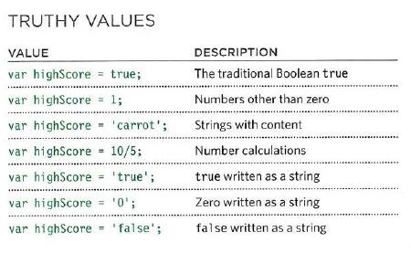
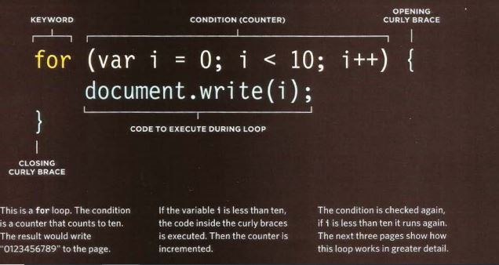

# HTML Lists, CSS Boxes, JS Control Flow

## Lists

There are lots of occasions when we need to use lists. HTML provides us with three different types:

* **Ordered lists:** are lists where each item in the list is numbered. This can be done by using the `<ol>` tag.

* **Unordered lists:** are lists that begin with a bullet point (rather than characters that indicate order). this can be done by using the `<ul>` tag.

* **Definition lists:** are made up of a set of terms along with the definitions for each of those terms. this can be done by using the `<dl>` tag.

## Boxes

### Box Dimensions (Width and Height)

By default a box is sized just big enough to hold its contents. To set your own dimensions for a box you can use the height and width properties like this:

    div.box {
height: 300px;
width: 300px;
background-color: #bbbbaa;}
p {
height: 75%;
width: 75%;
background-color: #0088dd;}

### Limiting width (min-width and max-width)

Some page designs expand and shrink to fit the size of the user's screen. In such designs, the min-width property specifies the smallest size a box can be displayed at when the browser window is narrow, and the max-width property indicates the maximum width a box can stretch to when the browser window is wide.

### Overflowing Content

The overflow property tells the browser what to do if the content contained within a box is larger than the box itself. It can have one of two values:

* **Hidden:** This property simply hides any extra content that does not fit in the box. 

* **scroll:** This property adds a scrollbar to the box so that users can scroll to see the missing content.

### Border, Margin and Padding

Every box has three available properties that can be adjusted to control its appearance:

1. **Border:** Every box has a border (even if it is not visible or is specified to be 0 pixels wide). The border separates the edge of one box from another.

2. **Margin:** Margins sit outside the edge of the border. You can set the width of a margin to create a gap between the borders of two adjacent boxes.

3. **Padding:** Padding is the space between the border of a box and any content contained within it. Adding padding can increase the readability of its contents.

### Change Inline/Block

The display property allows you to turn an inline element into a block-level element or vice versa, and can also be used to hide an element from the page.

The values this property can take are:

* **inline:** This causes a block-level element to act like an inline element.

* **block:** This causes an inline element to act like a block-level element.

* **inline-block:** This causes a block-level element to flow like an inline element, while retaining other features of a block-level element.

* **none:** This hides an element from the page. In this case, the element acts as though it is not on the page at all (although a user could still see the content of the box if they used the view source option in their browser).

### Rounded Corners (border-radius)

You can create rounded corners on any box, using a property called border-radius. The value indicates the size of the radius in pixels.

    p {
border: 5px solid #cccccc;
padding: 20px;
width: 275px;
text-align: center;
border-radius: 10px;
-moz-border-radius: 10px;
-webkit-border-radius: 10px;}

## IF-ELSE STATEMENT

The if else statement checks a condition.
If it resolves the true the first code block is executed.
If the condition resolves to false the second code block is run instead.For example:

    if (score >= pass) {
msg = 'Congratulations, you passed!';
} else {
msg = 'Have another go!';
var el = document .getElementByld('answer');

## SWITCH STATEMENTS

A switch statement starts with a variable called the switch value. Each case indicates a possible value for this variable and the code that should run if the variable matches that value. For example:

    switch (level) {
case 'O ne ':
title= 'Level 1 ' ;
break;
case 'Two':
tit 1 e = ' Level 2 ' ;
break;
case ' Three' :
title = 'Level 3' ;
break ;
default :
title= 'Test';
break;}

## TRUTHY & FALSY VALUES

Falsy values are treated as if they are fa 1 se. The following table shows a highScore variable with a series of values, all of which are falsy. Falsy values can also be treated as the number 0 .

Truthy values are treated as if they are true. Almost everything that is not in the falsy table can be treated as if it were true.

## LOOPS

Loops check a condition. If it returns true, a code block will run.
Then the condition will be checked again and if it still returns true, the code block will run again and so on, until it returns false. There are three types of loops:

* **for:** this loop used if you want to run code specific number of times.

* **While:** this loop is used if you don't know how many times the code should run.

* **Do While:** It's the same as while loop, but in Do loop it always run the statments inside the curly braces at least once, even if the condition evaluates to false.

