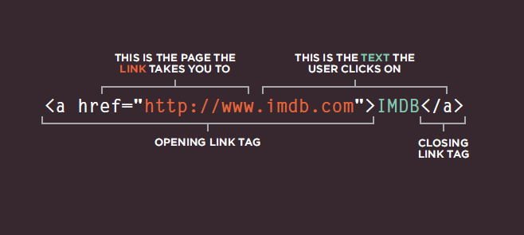
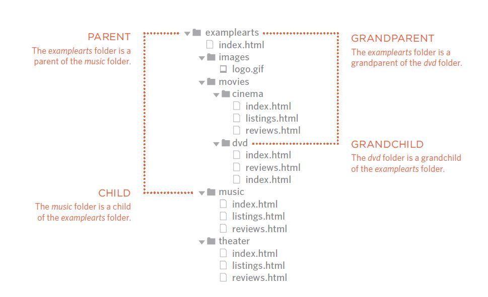
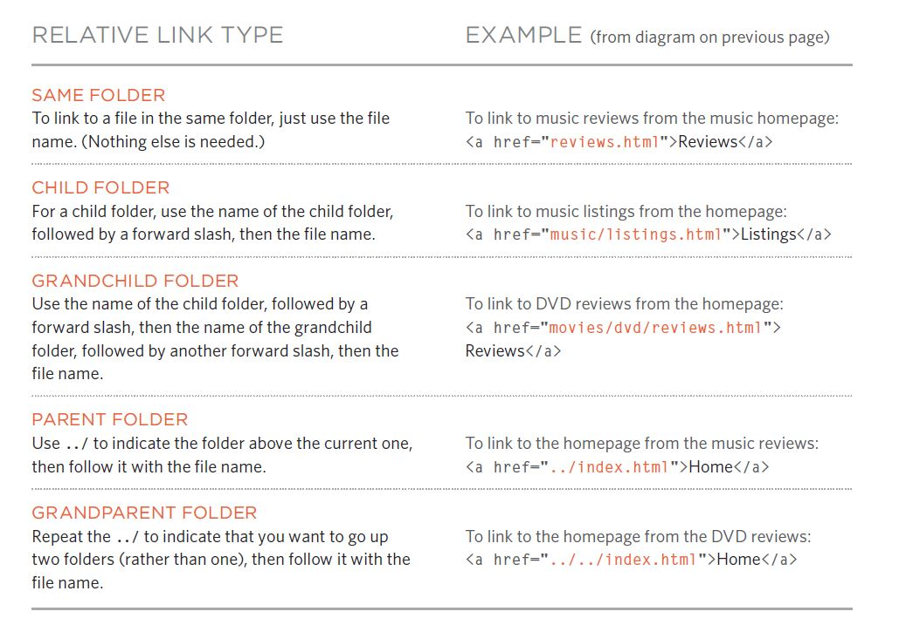

# HTML Links, JS Functions, and Intro to CSS Layout

## Links

Links are the defining feature of the web because they allow you to move from one web page to another — enabling the very idea of browsing or surfing.

Links are created using the < a> element. Users can click on anything between the opening < a> tag and the closing tag. You specify which page you want to link to using the href attribute. Syntax:

Linking to Other Sites Links are created using the < a> element which has an attribute called href. The value of the href attribute is the page that you want people to go to when they click on the link.

### Structure of Your Directory and the relative URL

The example bellow shows the structure of the directories and their relative url to each other.

### Email links

You can use `<a>` element also to starts up the user's email program and addresses an email to a specified email address but value of the href attribute starts with mailto: and is followed by the email address you want the email to be sent to.

## LAYOUT

### Building Blocks

CSS treats each HTML element as if it is in its own box. This box will either be a block-level box or an inline box.

Block-level boxes start on a new line and act as the main building blocks of any layout.

Examples include:

`<h1> 
 <ul> <li>`

 while inline boxes flow between surrounding text. You can control how much space each box takes up by setting the width of the boxes (and sometimes the height, too). To separate boxes, you can use borders, margins, padding, and background colors.

 Examples include:

` <b> <i>`

