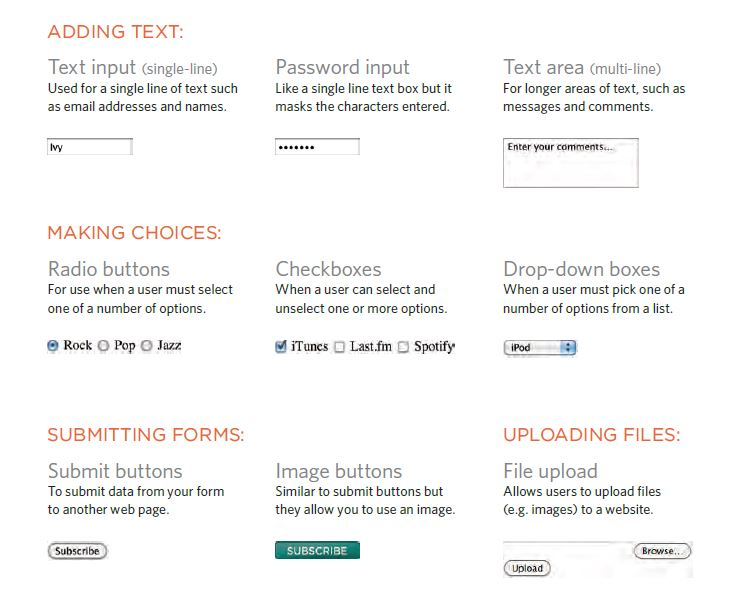
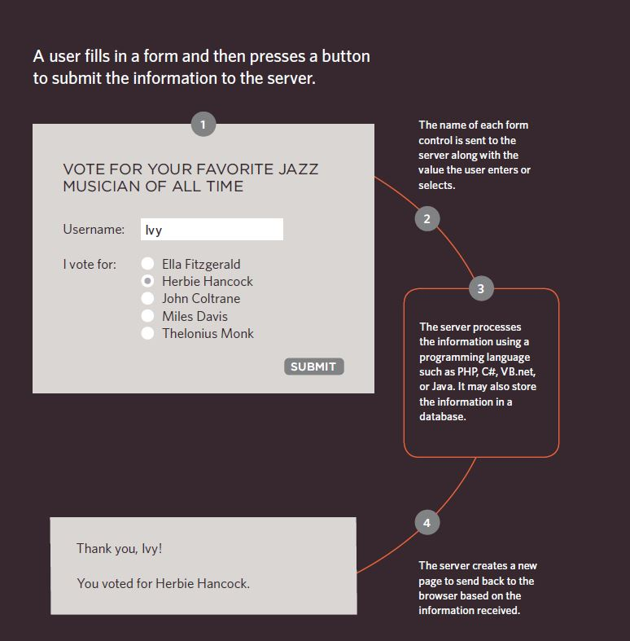

# Forms and JS Events

## Forms 

The best known form on the web is probably the search box that sits right in the middle of Google's homepage.

In addition to enabling users to search, forms also allow users to perform other functions online. You will see forms when registering as a member of a website, when shopping online, and when signing up for newsletters or mailing lists.

There are several types of form controls that you can use to collect information from visitors to your site.



### How forms work



### Form Structure

#### Form

Form controls live inside a `<form>` element. This element should always carry the action attribute and will usually have a method and id attribute too.

#### Action

Every `<form>` element requires an action attribute. Its value is the URL for the page on the server that will receive the information in the form when it is submitted.

#### method

Forms can be sent using one of two methods: get or post.

for example:

``` <form action="http://www.example.com/subscribe.php"
method="get">
<p>This is where the form controls will appear.
</p>
</form>
```

## Style

### list-style-type

The list-style-type property allows you to control the shape or style of a bullet point (also known as a marker).

It can be used on rules that apply to the `<ol>`, `<ul>`, and `<li>` elements.

#### Unordered lists

For an unordered list you can use the following values:

* none

* disc

* circle 

* square

#### ordered lists 

For an ordered (numbered) list you can use the following values:

* decimal:
1 2 3

* decimal-leading-zero:
01 02 03

* lower-alpha:
a b c

* upper-alpha:
A B C

* lower-roman:
i. ii. iii.

* upper-roman:
I II III

