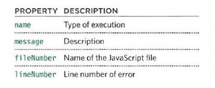

# Debugging

When you are writing JavaScript, do not expect to write it perfectly the first time. Programming is like problem solving: you are given a puzzle and not only do you have to solve it, but you also need to create the instructions that allow the computer to solve it. too.

When writing a long script, nobody gets everything right in their first attempt. The error messages that a browser gives look cryptic at first, but they can help you determine what went wrong in your JavaScript and how to fix it.

## EXECUTION CONTEXTS

The JavaScript interpreter uses the concept of **execution contexts**. There is one global execution context; plus, each function creates a new new execution context. They correspond to variable scope.

### Execution contexts

Every statement in a script lives in one of three execution contexts:

* **Global Context:** Code that is in the script, but not in a function. There is only one global context in any page.

* **FUNCTION CONTEXT:** Code that is being run within a function. Each function has its own function context.

### Variable Scopes 

* **Global Scope:** If a variable is declared outside a function, it can be used anywhere because it has global scope. If you do not use the var keyword when creating a variable, it is placed in global scope.

* **FUNCTION-LEVEL SCOPE:** When a variable is declared within a function, it can only be used within that function. This is because it has function-level scope.

### EXECUTION CONTEXT & HOISTING

Each time a script enters a new execution context, there are two phases of activity:

* **PREPARE**

* The new scope is created

* Variables, functions, and arguments are created

* The value of the this keyword is determined

* **EXECUTE**

* Now it can assign values to variables

* Reference functions and run their code

* Execute statements

## UNDERSTANDING ERRORS

If a JavaScript statement generates an error, then it throws an exception. At that point, the interpreter stops and looks for exception-handling code.

### ERROR OBJECTS

Error objects can help you find where your mistakes are and browsers have tools to help you read them.

When an Er ror object is created, it will contain the
following properties:

## BROWSER DEV TOOLS &JAVASCRIPT CONSOLE

The JavaScript console will tell you when there is a problem with a script, where to look for the problem, and what kind of issue it seems to be.

The console will show you when there is an error in your JavaScript. It also displays the line where it became a problem for the interpreter.

You can also just type code into the console and it will show you a result.

Browsers that have a console have a console object, which has several methods that your script can use to display data in the console. The object is documented in the Console API.

The console.log() method can write data from a script to the console. If you open console- log. html, you will see that a note is written to the console when the page loads.