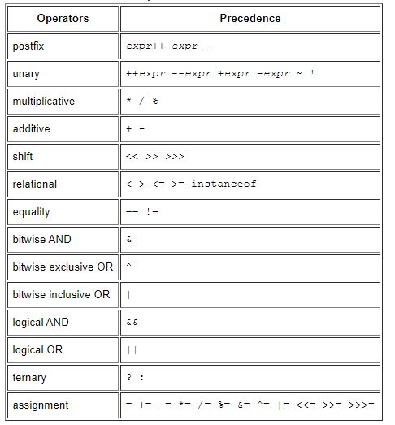

# Java Basics

## Variables

There are 4 types of variables in Java :

* Instance Variables (Non-Static Fields): these variables are declared without the static keyword, these variables are also known as instance variables because their values are unique to each instance of a class.

* Class Variables (Static Fields): these variables are declared within the class with the static keyword, this tells the compiler that there is exactly one copy of this variable in existence, regardless of how many times the class has been instantiated

* Local Variables: these variables are usually declared temporarily for a function and they are not accessible by the rest of the class.

* Parameters: parameters are always classified as "variables" not "fields.

## Primitive Data Types

The Java programming language is statically-typed, which means that all variables must first be declared before they can be used. This involves stating the variable's type and name.

The eight primitive data types supported by the Java programming language are:

* **byte**: The byte data type is an 8-bit signed two's complement integer. It has a minimum value of -128 and a maximum value of 127 (inclusive).

* **short**: The short data type is a 16-bit signed two's complement integer. It has a minimum value of -32,768 and a maximum value of 32,767 (inclusive).

* **int**: By default, the int data type is a 32-bit signed two's complement integer, which has a minimum value of -231 and a maximum value of 231.

* **long**: The long data type is a 64-bit two's complement integer. The signed long has a minimum value of -263 and a maximum value of 263.

* **float**: The float data type is a single-precision 32-bit IEEE 754 floating point.

* **double**: The double data type is a double-precision 64-bit IEEE 754 floating point.

* **boolean**: The boolean data type has only two possible values: true and false.

* **char**: The char data type is a single 16-bit Unicode character. It has a minimum value of '\u0000' (or 0) and a maximum value of '\uffff' (or 65,535 inclusive).

## Operators

Operators are special symbols that perform specific operations on one, two, or three operands, and then return a result.

The operators in the following table are listed according to precedence order:



## Expressions, Statements, and Blocks

Operators may be used in building expressions, which compute values; expressions are the core components of statements; statements may be grouped into blocks.

### Expressions

An expression is a construct made up of variables, operators, and method invocations, which are constructed according to the syntax of the language, that evaluates to a single value. You've already seen examples of expressions, illustrated below:

```java
int cadence = 0;
anArray[0] = 100;
System.out.println("Element 1 at index 0: " + anArray[0]);

int result = 1 + 2; // result is now 3
if (value1 == value2) 
    System.out.println("value1 == value2");
```

The data type of the value returned by an expression depends on the elements used in the expression. The expression cadence = 0 returns an int because the assignment operator returns a value of the same data type as its left-hand operand; in this case, cadence is an int. As you can see from the other expressions, an expression can return other types of values as well, such as boolean or String.

### Statements

Statements are roughly equivalent to sentences in natural languages. A statement forms a complete unit of execution.

```java
// assignment statement
aValue = 8933.234;

// increment statement
aValue++;

// method invocation statement
System.out.println("Hello World!");

// object creation statement
Bicycle myBike = new Bicycle();
```

### Blocks

A block is a group of zero or more statements between balanced braces and can be used anywhere a single statement is allowed.

The following example, illustrates the use of blocks:

```java
class BlockDemo {
     public static void main(String[] args) {
          boolean condition = true;
          if (condition) { // begin block 1
               System.out.println("Condition is true.");
          } // end block one
          else { // begin block 2
               System.out.println("Condition is false.");
          } // end block 2
     }
}
```

## What does it mean to compile code?

 everything in a computer is represented by a series of 1's and 0's. When the computer runs a program, the program itself is made of a bunch of 1's and 0's.

 since we still need humans to write our programs, putting everything in 1's and 0's (called machine language) would be very difficult. So we made higher level languages like Java and C# to write code in. These languages look a lot more like English, so they're a lot easier to write and maintain.

 When you compile code, the compilor (usually another program) takes the program the human wrote, and converts it into the program the computer can understand (i.e. converts from Java to machine language).