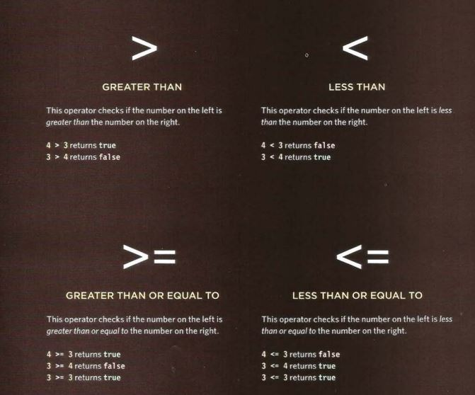
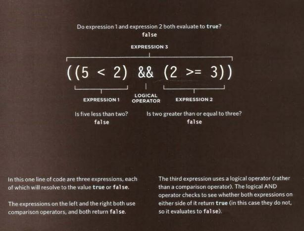
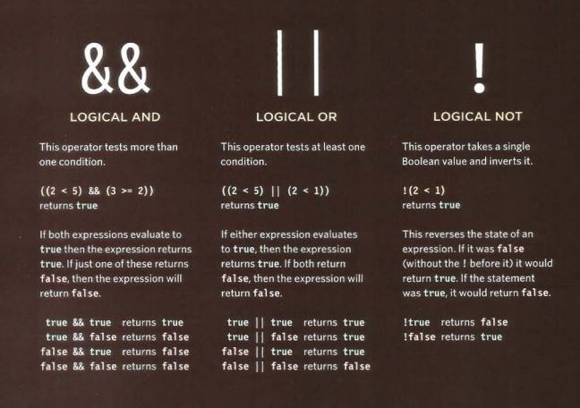

# COMPARISON OPERATORS: EVALUATING CONDITIONS

you can evaluate a situation by comparing one value in the script to what you expect it might be. the result will be a boolean : true or false. The following pictures show the different types of operator :

## LOGICAL OPERATORS

Comparison operators usually returns single value of true or false. Logical operators allow you to compare the results of more than one comparison operator. The following pictures show the different types of them :

# LOOPS 

Loops check a condition. If it returns true, a code block will run. Then the condition will be checked again and if it still returns true, the code block will run again. It repeats until the condition return false. there are three common types of loops:

## FOR

For loop used to run a code a specific number of times. It is the most common loop. Usually the condition here is a counter to tell how many times the code should run. The following picture illustrate how it can be used:

