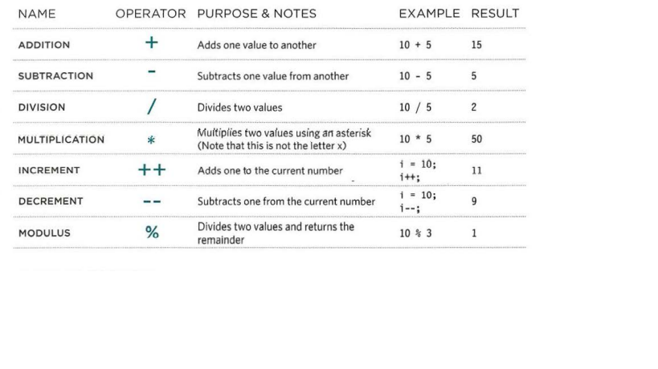

# JAVASCRIPT & JQUERY
**Learning programming with javascript involves:**
1. Understanding some basic programming concepts and the terms that JavaScript programmers use to describe them. 

2. Learning the language itself, and, like all languages, you need to know its vocabulary and how to structure your sentences.

3. Becoming familiar with how it is applied by looking at examples of how JavaScript is commonly used in websites today. 
**Uses of javascript**
Javascript allows you to make the web pages more interactive to the user for example:

1. Access the content of any element, attribute, or text from an HTML page, like you can select the text inside all of the **h1** element on a page.

2. Modify the content of any element, attribute, or text from an HTML page like you can change the class attribute to trigger new CSS rules.

**Javascript can make the web page feel interactive by responding to what the user does**

3. You can specify a set of steps to the browser to follow, which allows it to change or access the content, like  A gallery script could check which image a user clicked on and display a larger version of that image.  

4. You can specify that a script should run when a specific event has occurred, like when a button is pressed or a cursor hovers over an element.

# THE ABC OF PROGRAMMING
 you need to become familiar with some key concepts in computer programming. They will be covered in three sections: 

 **A** : what is a script and how do I create a one?

 **B** : How do computers fit in with the world around them?

 **C** : How do I write a script for a web page?

 # A

 A script is a series of instructions that a computer can follow to achieve a goal.

 To write a script, you need to put your goal firstly, and then list the tasks that need to be completed to achive that goal.

 Just like learning any new language, you need to get to grips with the:

 * Vocabulary: the word that computer can understand. 

 * Syntax : How you put those words together to create instructions computer can follow.

 # Expressions and operators

 **expressions** used to assign a value to a variable. There are two types of expressions: 

 1. Expressions that assign only a single value to the variable.
``` var color = 'beige'; ```

 2. Expressions that use two or more values to return a single value to the variable.
 ``` var area = 3 * 2;  ```

 **Operators**  they are the things that expressions rely on; they allow programmers to create a single value from one or more values.

 # ARITHMETI C OPERATORS

 JavaScript contains the following mathematical operators, which you can use with numbers. You may remember some from math class.  
 



